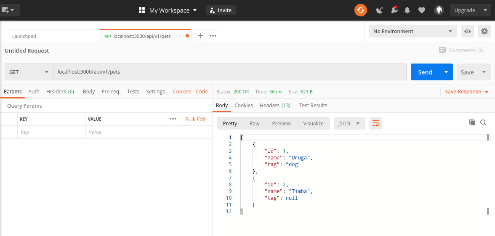

<h1 align="center">[Rails] GCOMM Tech Test / Petstore API  </h1>
<p>
  
  <a href="#" target="_blank">
    
  </a>
  <a href="https://twitter.com/ae_cordova" target="_blank">
    
  </a>
</p>

___
## Description of the project

This is a sample api to demonstrate technical proficiency on Rails. Implementation of the OpenAPI Specification example described in the following link: [OAS Example: Petstore](https://github.com/OAI/OpenAPI-Specification/blob/master/examples/v3.0/petstore.yaml).

| API EndPoints:  |   |
|---|---|
| GET api/v1/pets  | Respond with a list of all pets, page size: 100, including the lint to the next page in the x-next header  |
| GET api/v1/pets/:id  | Respond with specific information of the pet with id = :id  |
| POST api/v1/pets  | Create a new record for Pets, 'name' and 'id' attributes are required  |
| Restrictions: | Index response should be paginated and the link to the next page should be included in the headers |
|  |


### ⭐️ Built with
* Ruby on Rails 6

### Dev Environment Requirements:
* Ruby needs to be installed to run the code, check [here](https://www.ruby-lang.org/en/documentation/installation/) for further steps

### ⭐️ Running the code

#### Live Version:

You can find a live running version of this app on the following link: [Activity Logs](https://kinedu-test.herokuapp.com//)

#### Instructions for running on local environment:

1. Clone the repo

1. Navigate to the root directory

1. Run bundle install to ensure all the needed gems are installed:
    ```
    $ bundle install
    ```
1. Run Yarn Install
    ```
    $ yarn install --check-files
    ```
1. Migrate the DB
    ```
    $ rails db:migrate
    ```
1. Run Rails Server
    ```
    $ rails server
    ```
1. Open localhost:3000 on a browser to get to the home page
    ```
    https://localhost:3000
    ```
### ⭐️ How it works

1. Open and API testing tool such as [Postman](https://www.getpostman.com/ )

2. Send requests with the different urls as described in the endpoints section: base_url + path with the corresponding http method and parameters,
    for example: GET localhost:3000/api/v1/pets.
    <p align="center">
      
    </p>

3. Read the output in the response section of the tool(right pane in the example)

<!-- CONTRIBUTING -->
## Contributing

Any contributions you make are **greatly appreciated**.

1. Fork the Project
2. Create your Feature Branch (`git checkout -b feature/AmazingFeature`)
3. Commit your Changes (`git commit -m 'Add some AmazingFeature'`)
4. Push to the Branch (`git push origin feature/AmazingFeature`)
5. Open a Pull Request


## Authors

👤 **Angel Cordova** 
* Github: [@aecordova](https://github.com/https:\/\/github.com\/aecordova)  
